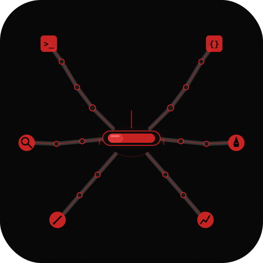

<p align="center"></p>

# solocrew™

*You're the CEO. They're your crew.*

Run a one-person company with an AI agent fleet. Each Telegram bot is a virtual employee — wired to its own Claude Code session, project, and purpose.

 

```
YOU (phone)
  |
  v
Telegram Bot (your crew member)
  |
  v
Claude Code Session <---> Your Project
  |
  v
Code, Deploy, Research, Write
```

```
Terminal 1:  claudedev      -> @DevBot       -> ~/projects/app
Terminal 2:  claudewriter   -> @WriterBot    -> ~/projects/content
Terminal 3:  clauderesearch -> @ResearchBot  -> ~/projects/market-intel
Terminal 4:  claudeops      -> @OpsBot       -> ~/projects/infra
```

## Quick Start

**1. Install Bun** (required — channel plugins won't work without it)

```bash
curl -fsSL https://bun.sh/install | bash
```

**2. Install the plugin**

```bash
claude plugin add mukulkulkarni/solocrew
```

**3. Create a Telegram bot**

Open Telegram, message [@BotFather](https://t.me/BotFather), and run `/newbot`. Copy the token it gives you.

**4. Create a crew member**

Inside any Claude Code session:

```
/solocrew create
```

Follow the interactive prompts — provide a name, purpose, project path, and your bot token.

**5. Source your shell**

```bash
source ~/.zshrc    # or ~/.bashrc
```

**6. DM your bot**

Open Telegram, find your bot by username, and send it a message. It responds via Claude Code.

To launch the bot session in your terminal:

```bash
claudedev          # autonomous mode (no permission prompts)
claudedev-safe     # safe mode (asks before risky actions)
```

## Commands Reference

| Command | Description |
|---|---|
| `/solocrew create` | Interactively create a new bot crew member |
| `/solocrew list` | List all registered bots and their status |
| `/solocrew status` | Show detailed status for a specific bot |
| `/solocrew delete` | Remove a bot and clean up its directory and aliases |
| `/solocrew migrate` | Migrate registry to the latest schema version |
| `/solocrew group create` | Create a named group for organizing bots |
| `/solocrew group add` | Add a bot to a group |
| `/solocrew group list` | List all groups and their members |
| `/solocrew group delete` | Delete a group |
| `/solocrew help` | Show all available commands and usage |

## Example Crews

| Crew Setup | Members | Use Case |
|---|---|---|
| Solo Developer | frontend-dev, backend-dev, devops | One bot per concern |
| Content Creator | writer, researcher, seo-analyst | Research, write, optimize |
| Market Intelligence | market-research, competitor-watch, trend-scout | Track competitors, surface opportunities |
| Customer Ops | sentiment-analyst, support-helper, feedback-digest | Monitor sentiment, draft responses |
| One-Person Startup | All of the above, grouped | The full crew running in parallel |

## How It Works

**Registry** — All bots are tracked in `~/.claude/crew-registry.json`, a versioned JSON file that stores each bot's name, channel, purpose, project path, alias, group, and creation date.

**Shell aliases** — Each bot gets two shell aliases injected into your `~/.zshrc` (or `~/.bashrc`):
- `<alias>` — Autonomous mode with `--dangerously-skip-permissions`. For trusted, unattended bots.
- `<alias>-safe` — Standard mode where Claude asks before risky actions. For interactive or sensitive work.

**Per-bot directories** — Each bot has its own directory at `~/.claude/channels/crew-<name>/` containing its `.env` (token), `access.json` (allowlist), and `instructions.md` (role description).

**Access control** — By default, bots use an allowlist-based DM policy. Only Telegram user IDs in `access.json` can interact with the bot.

**Groups** — Bots can be organized into named groups (e.g., "dev", "content", "ops") for logical organization. Groups are labels today with automation planned for future versions.

**instructions.md** — A reference file describing the bot's role and personality. It is not auto-injected into Claude sessions. To activate it, symlink or include it in your project's `CLAUDE.md`.

## Prerequisites

- **Claude Code v2.1.80+** (channels support required)
- **Telegram bot token** (from [@BotFather](https://t.me/BotFather))
- **Bun runtime** — required by channel plugins. Install: `curl -fsSL https://bun.sh/install | bash`. The Telegram plugin **silently fails** without Bun (Node.js won't work).
- **claude.ai login** (API keys don't support channels)

## Manual Install

If you prefer not to use the plugin system:

```bash
git clone https://github.com/mukulkulkarni/solocrew.git
mkdir -p ~/.claude/skills/solocrew
cp solocrew/skills/solocrew/SKILL.md ~/.claude/skills/solocrew/SKILL.md
```

Then use `/solocrew` in any Claude Code session.

## Roadmap

### v1.0 (current)

- Telegram bot fleet management
- Interactive bot creation with `/solocrew create`
- Central registry with groups and version field
- Dual aliases per bot: `<alias>` (autonomous) + `<alias>-safe` (with permission prompts)
- Shell aliases for one-command bot launch
- Allowlist-based access control

### v1.1 (near-term)

- Discord channel support (registry schema already supports it)
- SOUL.md personality templates per bot
- Topic-based routing in Telegram supergroups
- Webhook/CI triggers for proactive notifications
- Bot status health checks

### v2.0 (future)

- Shared memory between bots (async, file-based)
- Heartbeat monitoring with cron loops
- Cross-agent task delegation
- Custom channel support (Slack, WhatsApp when available)
- Fleet dashboard (local web UI)
- Inference cascade support (route to different models per bot)

## Comparison with Alternatives

There are several projects in the multi-agent space, each with different trade-offs. **OpenClaw** is a full framework supporting 20+ channels, but it requires a gateway daemon and significant infrastructure to run. **cc-connect** acts as a relay bridge to 9 platforms, but offers no fleet orchestration or management layer. **ai-fleet** provides CLI-based parallel agents with worktree isolation, but has no messaging integration. **herdctl** targets a similar concept but is Docker-focused rather than Claude Code native.

**solocrew** takes a different approach: it's a lightweight skill that plugs directly into Claude Code with zero infrastructure. One command to install, one command to create a bot. No daemons, no containers, no gateway servers. If Claude Code is your IDE, solocrew is the natural way to extend it into a messaging-based agent fleet.

## Need a Crew for Your Business?

solocrew is free and open source for individuals.

For teams and businesses that want a managed agent fleet:

- Fleet architecture design and strategy
- Custom agent personalities and workflows
- Multi-channel deployment (Telegram, Discord, Slack)
- Security hardening and compliance
- Ongoing fleet optimization and training

**Built and maintained by [Infini Imaginator](https://imaginator.in)**

| Tier | Crew Size | What You Get |
|---|---|---|
| Starter | 3-5 bots | Fleet setup, basic personalities, one channel |
| Growth | 10-20 bots | Multi-channel, custom workflows, team training |
| Enterprise | 20+ bots | Full agent workforce strategy, compliance, SLA |

## Testing

Manual smoke test:

1. Install the plugin: `claude plugin add mukulkulkarni/solocrew`
2. Run `/solocrew create test` — provide a test token and project path
3. Verify the bot directory exists at `~/.claude/channels/crew-test/`
4. Verify the shell alias was added to your shell config
5. Verify the registry entry in `~/.claude/crew-registry.json`
6. Run `/solocrew delete test`
7. Verify the directory, alias, and registry entry were cleaned up

## Contributing

Contributions are welcome! Fork the repo, create a feature branch, and open a pull request.

Areas where help is especially appreciated:
- New channel adapters (Discord, Slack)
- Fleet management features
- Documentation and examples

## License

[MIT](LICENSE)

---

solocrew™ is free and open source under the MIT license.
The solocrew name and logo are trademarks of Mukul Kulkarni.
